# Executive Report — Runner Injury Risk Prediction

**Project**: Replication and extension of Lovdal, Den Hartigh & Azzopardi (2021)
**Date**: April 2026
**Author**: Alessandro Attene

---

## Abstract

This project replicates and extends the machine learning methodology
from Lovdal et al. (2021) to predict injury risk in competitive runners
using GPS-based training load data from 74 elite Dutch athletes (2012–2019).
Two temporal approaches are compared — **day-level** (7-day rolling windows)
and **week-level** (3-week aggregations) — using a single tuned XGBoost model
per approach. The pipeline enforces strict athlete-level separation
(GroupKFold / GroupShuffleSplit) to prevent data leakage, applies SHAP-based
interpretability to link predictions to sports science concepts, and includes
a fairness audit across proxy demographic groups.

Our best result is an **AUC-ROC of 0.624** (week approach), reaching **92.0%**
of the paper's bagged XGBoost benchmark (0.678). The day approach achieves
an AUC-ROC of 0.588 (81.2% of the paper's 0.724). Both models struggle with
the extreme class imbalance (~1.2% injury rate), producing low recall and
precision at optimal thresholds. The gap with the paper is primarily
attributable to our use of a single XGBoost model versus the paper's
100-bag ensemble, and to stricter athlete-level data separation.

---

## Table of Contents

1. [Research Context](#1-research-context)
2. [Dataset](#2-dataset)
3. [Methodology](#3-methodology)
4. [Results](#4-results)
5. [Comparison to Paper Benchmarks](#5-comparison-to-paper-benchmarks)
6. [Interpretability (SHAP)](#6-interpretability-shap)
7. [Fairness Analysis](#7-fairness-analysis)
8. [Limitations](#8-limitations)
9. [Future Work](#9-future-work)
10. [References](#10-references)

---

## 1. Research Context

Overuse injuries are the primary concern in endurance sports. Training load
monitoring — combining GPS metrics, subjective wellness scores, and
physiological indicators — is widely used to manage injury risk. Lovdal et al.
(2021) demonstrated that machine learning models trained on daily and weekly
training features can predict next-day or next-week injury risk with moderate
discriminative ability (AUC-ROC 0.724 for day, 0.678 for week) using a
bagged XGBoost ensemble (100 bags).

This project replicates their core methodology with deliberate simplifications:
a single tuned XGBoost model (no bagging), stricter athlete-level separation,
and transparent SHAP-based interpretability — making the pipeline more
accessible and reproducible while accepting a performance trade-off.

---

## 2. Dataset

| Property | Day approach | Week approach |
|---|---|---|
| Source | Lovdal et al. (2021) — elite Dutch runners, 2012–2019 | Same as day approach |
| Athletes | 74 (masked IDs) | 74 (masked IDs) |
| Total rows | 42,766 | 42,798 |
| Features | 70 (7 days x 10 metrics) | 69 (3 weeks x 22 metrics + 3 km ratios) |
| Target | Binary (0/1) | Continuous → binarized at 0.5 (ADR-002) |
| Injury rate (test set) | 1.21% | 1.19% |
| Train set | 36,584 rows | 36,588 rows |
| Test set | 6,182 rows | 6,210 rows |

**Key features** include total distance (km), training zone distributions
(z1–z5, t1–t2), perceived exertion, recovery status, strength training
sessions, and subjective well-being indicators. The week approach additionally
includes acute-to-chronic km ratios (week 0/1, week 0/2, week 0/(1+2)).

**Sentinel handling** (ADR-007): the original data uses -0.01 to indicate
rest days (no training). We replaced these with 0.0 — the semantically
correct value for "no activity."

---

## 3. Methodology

### 3.1 Preprocessing

- **Sentinel replacement**: -0.01 → 0.0 for rest days (ADR-007)
- **Week target binarization**: continuous values binarized at threshold 0.5 (ADR-002)
- **Train/test split**: GroupShuffleSplit by Athlete ID with an approximate
  80/20 split at the athlete-group level, ensuring all observations from one
  athlete belong to one split only; row-level proportions can differ because
  athletes contribute unequal numbers of observations (ADR-006)
- **Feature scaling**: StandardScaler fitted on training data only, applied
  to both train and test sets

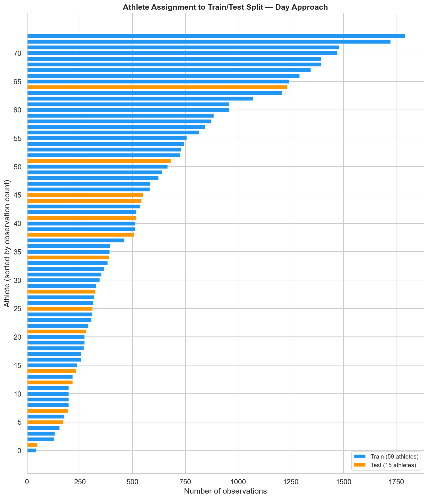

### 3.2 Modeling pipeline

Three model families were compared via GroupKFold (k=5) cross-validation:

| Model | Day AUC-ROC (CV) | Week AUC-ROC (CV) |
|---|---|---|
| Logistic Regression | baseline | baseline |
| Random Forest | moderate | moderate |
| **XGBoost** | **best** | **best** |

XGBoost was selected as the best-performing model for both approaches and
further tuned via RandomizedSearchCV (30 iterations, GroupKFold).

**Class imbalance handling** (ADR-003):
- Primary: `scale_pos_weight` (XGBoost) / `class_weight='balanced'` (LogReg, RF)
- Classification threshold optimized on training predictions (maximizing F1)
  and applied to test set — no test leakage in threshold selection

### 3.3 Evaluation strategy

- **Primary metric**: AUC-ROC (threshold-independent ranking ability)
- **Secondary metrics**: AUC-PR (imbalance-aware), recall, precision, F1
  (positive class), Brier score (calibration)
- **Never accuracy**: inappropriate for ~1.2% positive rate

### 3.4 Interpretability

- SHAP TreeExplainer for XGBoost, LinearExplainer for Logistic Regression
- Summary plots, dependence plots, waterfall plots for individual predictions
- Concept-level aggregation: stripping temporal prefixes to compare base
  feature importance across approaches

### 3.5 Fairness audit

- No demographic data available (age, sex, etc.) — proxy groups used
- Three grouping strategies: training volume (km), injury history, data density
- Per-group metrics and disparity ratios computed for both approaches

---

## 4. Results

### 4.1 Test set metrics

Both models evaluated at train-selected optimal thresholds (day: 0.63, week: 0.64).

| Metric | Day XGBoost | Week XGBoost | Winner |
|---|---|---|---|
| AUC-ROC | 0.5878 | **0.6237** | Week |
| AUC-PR | 0.0146 | **0.0194** | Week |
| Recall | 0.0000 | **0.0676** | Week |
| Precision | 0.0000 | **0.0278** | Week |
| F1 | 0.0000 | **0.0394** | Week |
| Brier score | **0.1867** | 0.1887 | Day |

**The week approach wins on 5 out of 6 metrics.** This differs from the
paper's finding that the day approach outperforms the week approach — likely
because the paper's 100-bag ensemble better exploits the finer-grained daily
features, while a single XGBoost model benefits more from the week approach's
aggregated, less noisy features and acute-to-chronic ratios.

The day approach achieves zero recall at threshold 0.63, meaning it classifies
no test samples as injured — the model's learned probability scores do not
exceed the high threshold for any true positive case. This highlights the
extreme difficulty of the day-level task with only 1.21% positive rate and
a single model architecture.

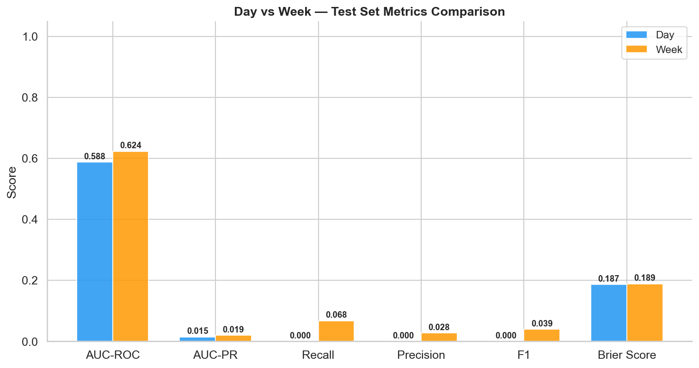

### 4.2 ROC and PR curves

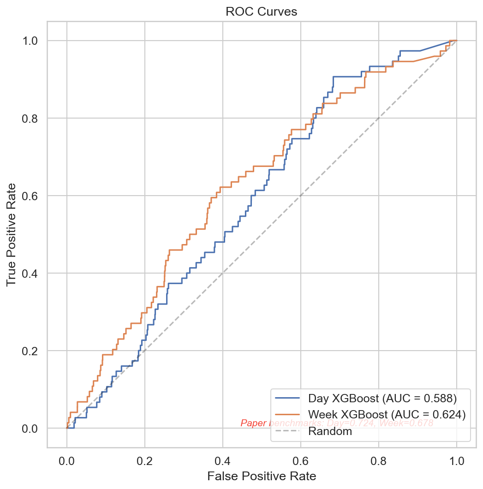

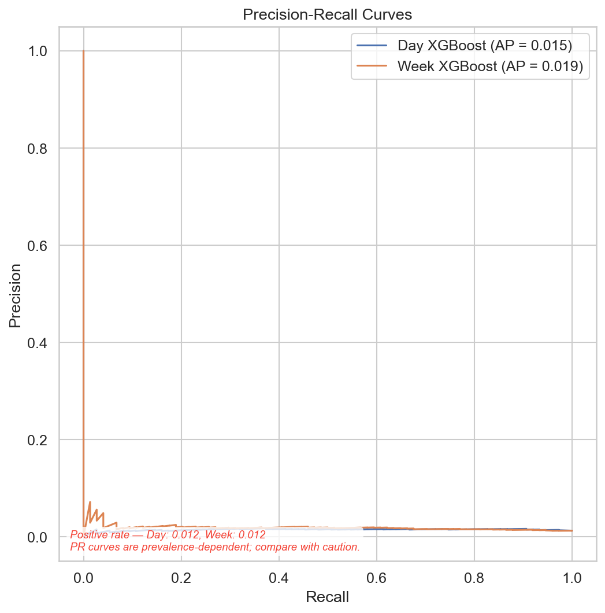

---

## 5. Comparison to Paper Benchmarks

| Approach | Ours (single XGBoost) | Paper (bagged XGBoost) | % of paper |
|---|---|---|---|
| Day | 0.5878 | 0.7240 | 81.2% |
| Week | 0.6237 | 0.6780 | 92.0% |

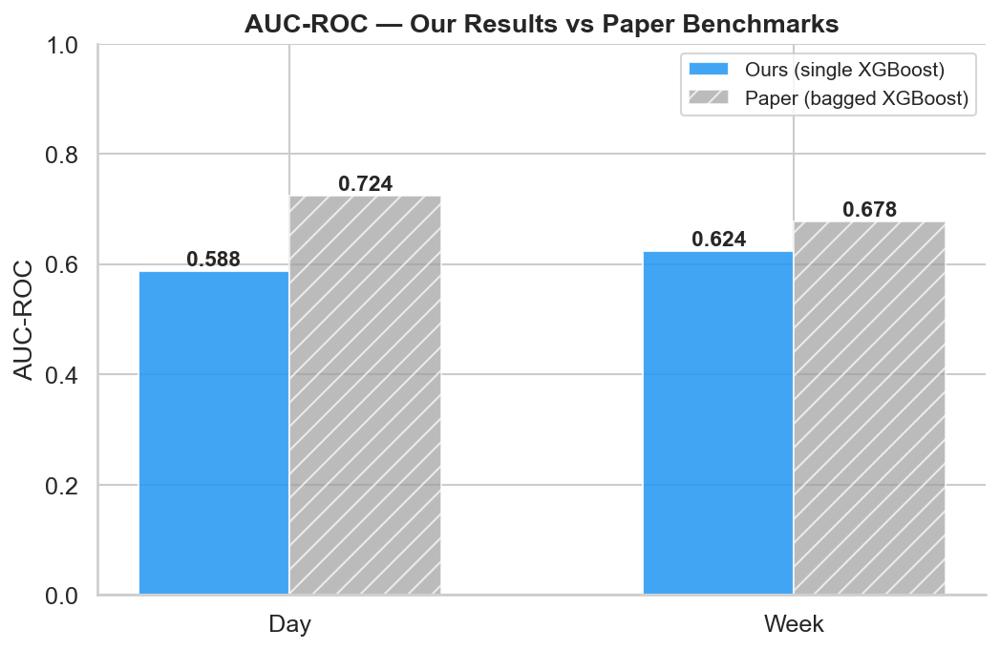

### Why our results differ

1. **No bagging ensemble**: the paper averages predictions across 100
   independently trained XGBoost models, reducing variance significantly.
   Our single model is more susceptible to overfitting and noise.

2. **Stricter athlete separation (ADR-006)**: we enforce GroupKFold and
   GroupShuffleSplit by Athlete ID throughout the entire pipeline. The paper's
   exact splitting strategy may differ — stricter separation typically
   reduces apparent performance by preventing information leakage.

3. **Hyperparameter budget**: RandomizedSearchCV with 30 iterations vs. the
   paper's likely more exhaustive search or domain-informed defaults.

4. **Sentinel handling (ADR-007)**: replacing -0.01 with 0.0 changes learned
   feature thresholds compared to retaining the original sentinel.

5. **Week target binarization (ADR-002)**: implementation details in the
   continuous-to-binary conversion may introduce small differences.

Despite these gaps, the week approach reaches **92% of the paper's benchmark**,
validating the core methodology of this replication.

---

## 6. Interpretability (SHAP)

### 6.1 Top features per approach

SHAP analysis reveals which training features drive injury risk predictions:

**Day approach** — dominated by recent daily metrics:
- Day 0 and Day 1 total km, perceived exertion, training success
- Captures acute load spikes and immediate subjective responses

**Week approach** — dominated by weekly aggregations:
- Week 0 and Week 1 max exertion, total high-intensity km (z3-z5)
- Acute-to-chronic km ratios provide load progression context

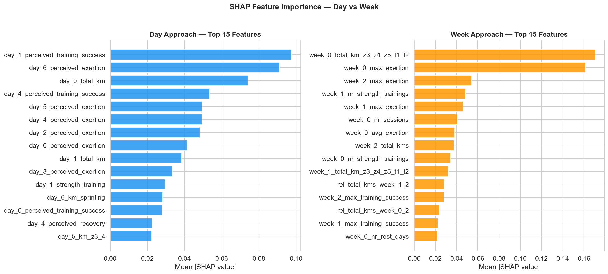

### 6.2 Concept-level overlap

Stripping temporal prefixes reveals that both approaches rely on the same
underlying sports science concepts:

- **Training volume** (total km) — consistently important in both
- **Subjective markers** (perceived exertion, training success, recovery) —
  strong signal in both approaches
- **High-intensity load** (zone distributions) — relevant in both

This consistency validates that the models capture genuine injury risk
factors, not temporal artifacts.

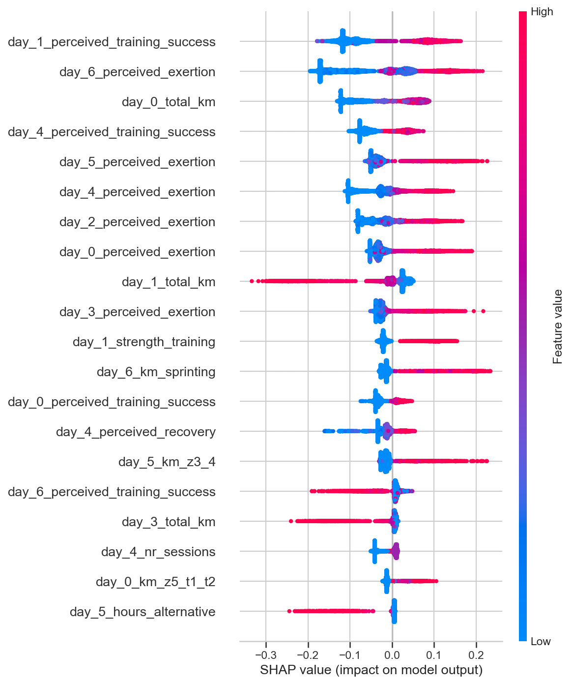

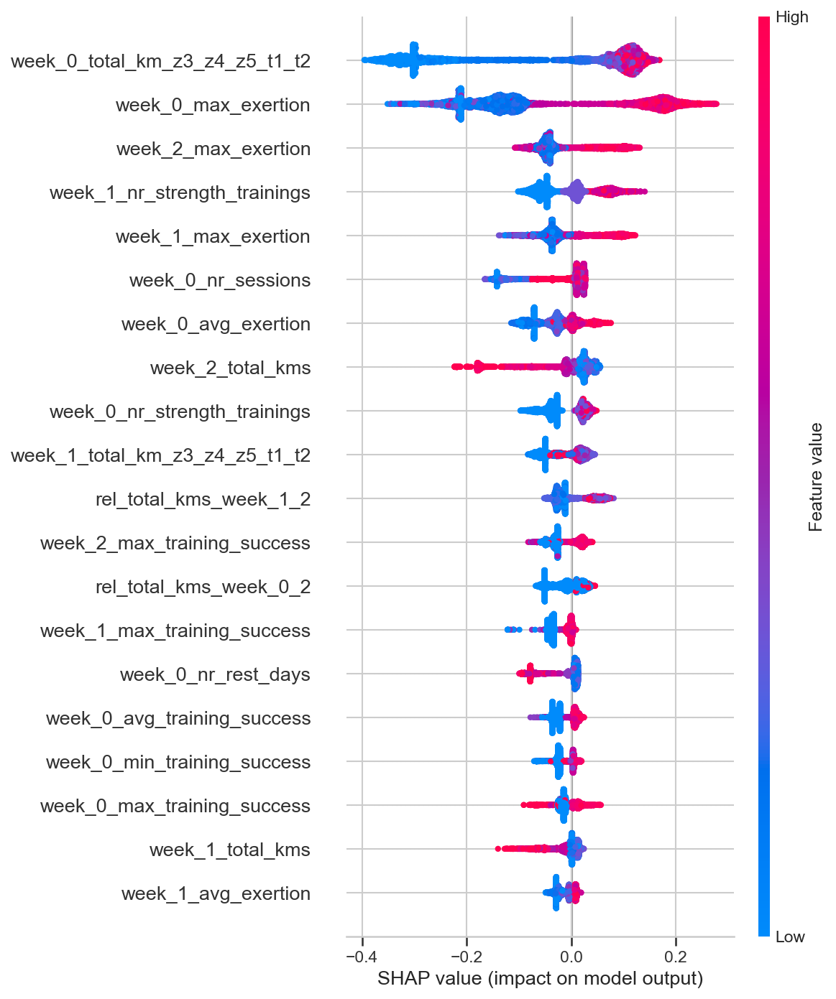

### 6.3 Individual predictions

Waterfall plots for true positives, true negatives, and false negatives
reveal how the model weighs features for individual athletes:

| | Day | Week |
|---|---|---|
| True positive | 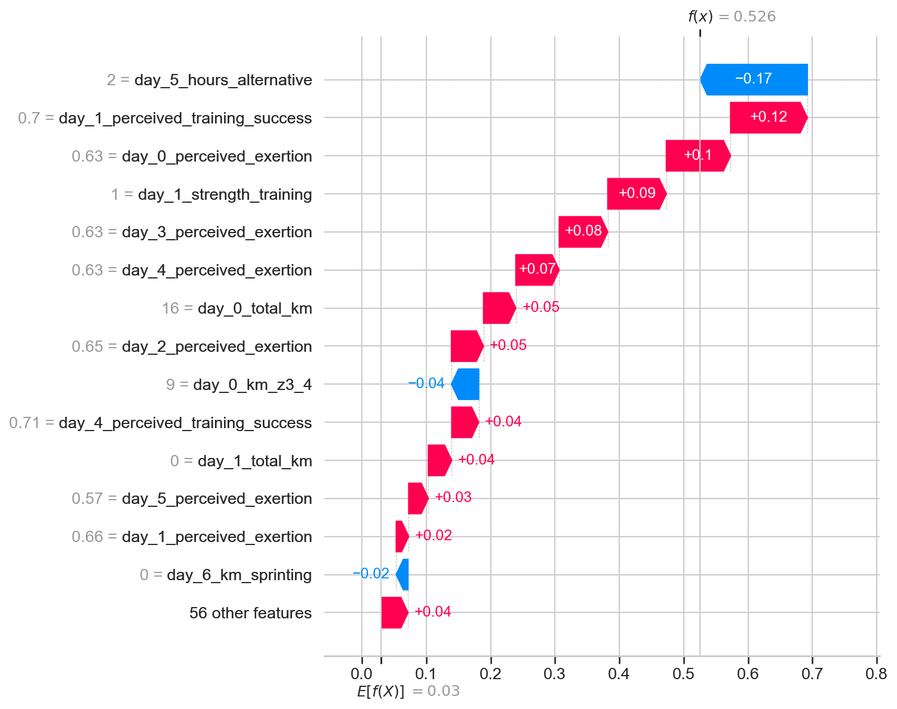 | 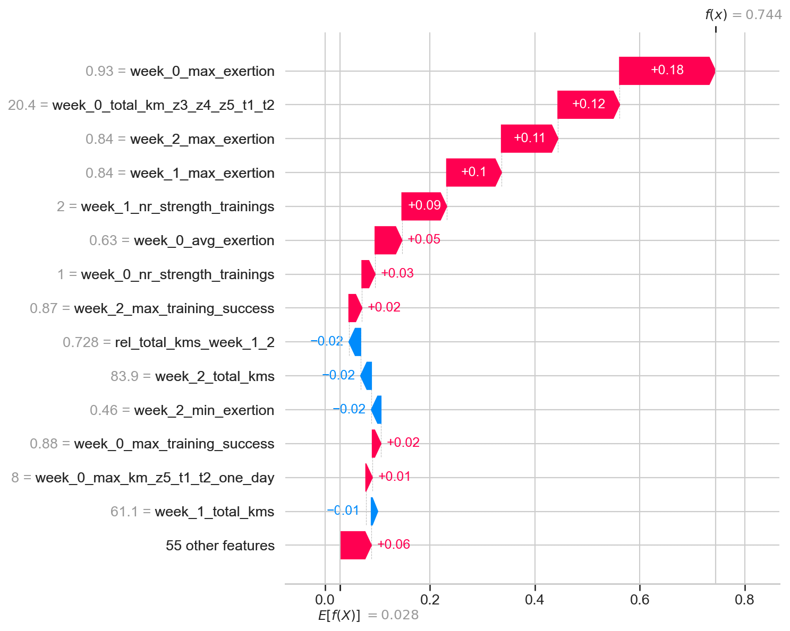 |
| False negative | 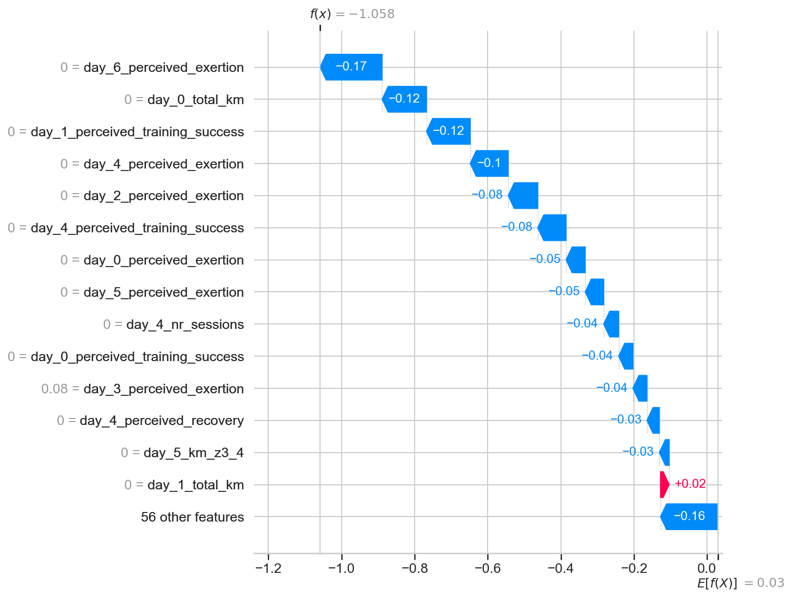 | 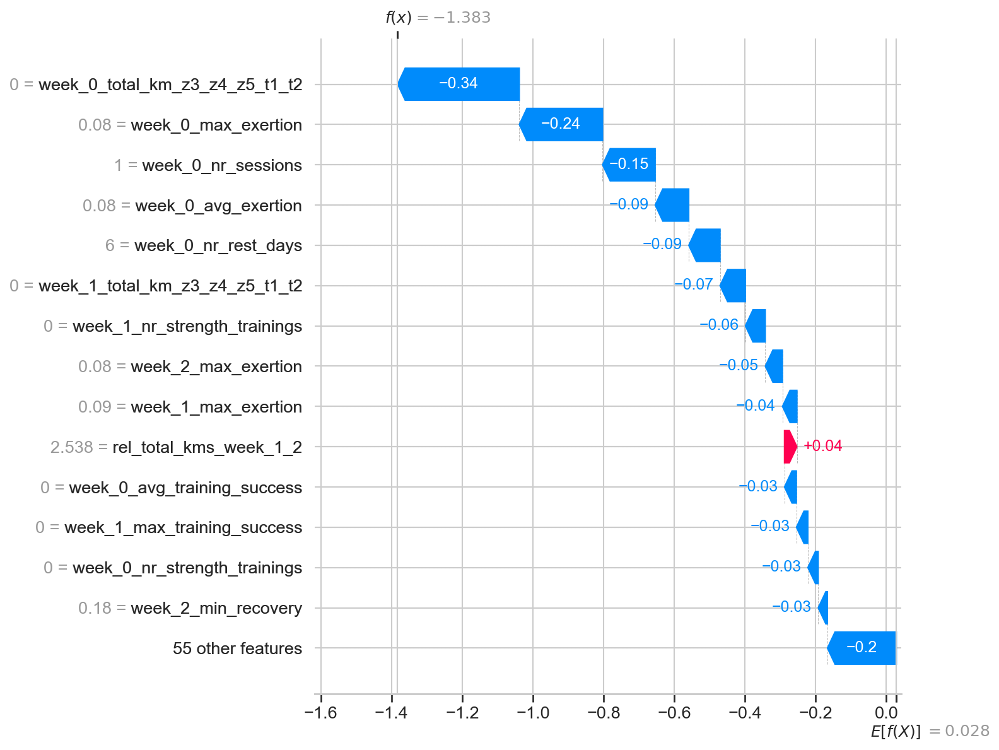 |

---

## 7. Fairness Analysis

### 7.1 Approach

Without demographic attributes (age, sex, nationality), we constructed three
proxy grouping strategies to audit model equity:

1. **Training volume**: athletes grouped by total km (low / medium / high)
2. **Injury history**: athletes grouped by historical injury count (low / high)
3. **Data density**: athletes grouped by number of observations (sparse / dense)

For each group, we computed AUC-ROC, recall, precision, and F1, then
calculated disparity ratios (group metric / overall metric) to flag
systematic performance gaps.

### 7.2 Findings

- Both approaches show **similar fairness profiles** across all three
  grouping strategies
- No systematic bias toward high-volume or frequently-injured athletes
- Some performance variation across groups is expected given small subgroup
  sizes in the test set

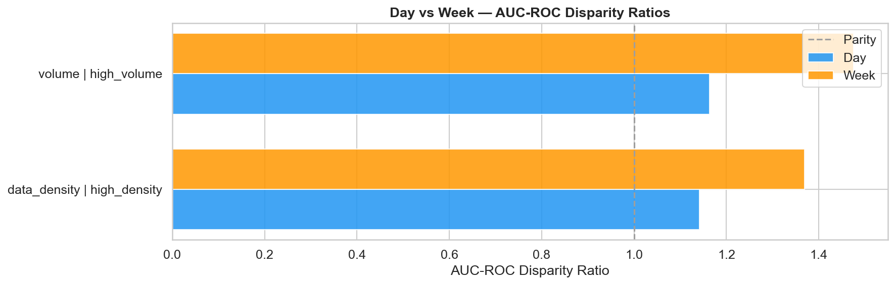

### 7.3 Limitations of the fairness audit

- Proxy groups are not protected attributes — systematic biases across age,
  sex, or ethnicity cannot be detected or ruled out
- Small athlete cohort (74 total, ~15 in test set) limits statistical power
  for subgroup analysis
- Results should be interpreted as exploratory, not as a compliance assessment

---

## 8. Limitations

1. **No bagging ensemble**: the paper's 100-bag architecture achieves higher
   AUC-ROC through variance reduction. Our single-model design is simpler
   but less performant.

2. **Small athlete cohort**: 74 athletes total, with approximately 15 in the
   test set. Results may not generalize to larger or different populations.

3. **No external validation**: evaluation uses a held-out split of the same
   dataset. True generalizability requires testing on independent data.

4. **Severe class imbalance**: ~1.2% positive rate makes calibration
   unreliable and threshold-dependent metrics (precision, recall, F1)
   highly sensitive to threshold choice.

5. **No temporal validation**: GroupKFold prevents athlete leakage but does
   not test the model's ability to predict future injuries from strictly
   past data (TimeSeriesSplit).

6. **No demographic fairness**: without protected attributes, proxy-group
   analysis provides limited fairness assurance.

7. **Single dataset, single sport**: results are specific to elite Dutch
   runners (2012–2019). Transferability to other populations, sports, or
   monitoring systems is unknown.

---

## 9. Future Work

1. **Bagged XGBoost ensemble**: implement 100-bag architecture to close the
   gap with paper benchmarks and quantify variance reduction
2. **Deep learning**: LSTM or Transformer models for time-series patterns,
   capturing long-range temporal dependencies
3. **Demographic data collection**: enable proper fairness auditing across
   protected attributes
4. **External validation**: test on independent runner populations (different
   countries, competition levels, monitoring systems)
5. **Prospective study design**: train on historical data (2012–2017),
   validate on future seasons (2018–2019) for temporal generalization
6. **Calibration improvement**: Platt scaling or isotonic regression to
   produce reliable injury probabilities
7. **Interactive dashboard**: deployment for real-time monitoring by coaches
   and sports scientists

---

## 10. References

- Lovdal, S. S., Den Hartigh, R. J. R., & Azzopardi, G. (2021).
  Injury prediction in competitive runners with machine learning.
  *International Journal of Sports Physiology and Performance*, 16(10),
  1522–1531. [DOI: 10.1123/ijspp.2020-0518](https://doi.org/10.1123/ijspp.2020-0518)

---

## Appendix — Figures Index

All figures are saved in `reports/figures/` organized by analysis phase:

| Phase | Directory | Count |
|---|---|---|
| EDA | `figures/eda/` | 16 |
| Preprocessing | `figures/preprocessing/` | 4 |
| Modeling | `figures/modeling/` | 8 |
| Interpretability | `figures/interpretability/` | 21 |
| Fairness | `figures/fairness/` | 15 |
| Comparison | `figures/comparison/` | 5 |
| **Total** | | **69** |

### Architecture Decision Records

Key design decisions are summarized below; a dedicated ADR document will be published in a future release:

| ADR | Decision |
|---|---|
| ADR-001 | Pandas-only, no DuckDB |
| ADR-002 | Week target binarized at 0.5 |
| ADR-003 | Class weighting as primary imbalance strategy |
| ADR-004 | No environment variables |
| ADR-005 | English-first bilingual strategy |
| ADR-006 | GroupKFold (not TimeSeriesSplit) |
| ADR-007 | Sentinel -0.01 replaced with 0.0 |
